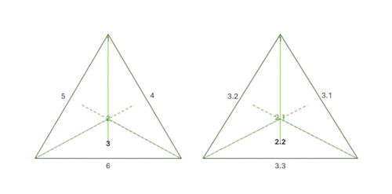

# NC_src_VR_en.md

## On the creation from nothing 

The concept of the (i) creation from (ii) ***nothing*** (***creatio ex nihilo***) implies, from the perspective of *existing empiricism*[^1], strictly speaking, the assumption of a ***virtual structure*** (**VR**) of the *existing empiricism*, which is causally *underlyed* by an intangible, yet knowingly and willfully acting and creating ***<ins>real</ins> world*** (**R**), as also indicated in the *Phænomena* of Aratus:

>"**M**Vndus est compages ex cælo, terráq;, & iis naturis coagmentata quæ vtroque continentur. Cœlum est id quod omnia, quæ sunt, præter [...] ", (Petavius, [1630](https://doi.org/10.3931/e-rara-2004), p. 261).

>The world is a structure of heaven and earth, connected by the natures contained in both. The Universe is that what all things, except [...], are.

Here, too, one legitimately refrains from further descriptions of the incomprehensible *reality* **R** and presents exclusively the developmental and creative *phenomena* in the *virtual structure* **VR**, the *existing empirical evidence*:

>" [...] iis, quæ in sublimi cernuntur.", (Petavius, [1630](https://doi.org/10.3931/e-rara-2004), p. 261).

> [...] those things which are seen in the sublime. 

The basic explanation is therefore obvious, since some form of (i) ***being*** is **indispensable and inevitable**, because, purely formally speaking, a *complete* ***nothing*** must clearly also ***be***, otherwise one would have a *non* ***nothing*** and thus *some* basic ***being*** anyway.

The ***origin*** itself, the ***nothingness***, in this analogy can be seen in the (ii) **linear time** *t={}*, in the common *time characteristic* of **R** and **VR**, or the common *timing*, which is *in concreto* very clearly shown on the *Third Day* in the explanations about the *waters*, with *springs* (**R**) <ins>*{and}*</ins> *lakes* (**VR**).

It should be noted that the *Second* and *First* days, *Order* and *Creation*, are taking place in **R**, are only indirectly recognized as a logical, recursive predecessor image in **VR** from *Day Three* onward, *Design* and further *Ornamentation*. This representation is thus continued retrospectively in the *Preface*:

>"quam pleni [et] [con]summati boni fons i[n] ip[s]o erat: vt ab eo bono tam[que]m riu[us] ordieret[ur].", (Schedel, [1493](https://daten.digitale-sammlungen.de/~db/0003/bsb00034024/images/index.html?id=00034024), fol. 2r).

>In himself was the source of perfect and accomplished goodness, so that goodness might flow forth from it like a stream.

Continuing in *Day One*:

>"Gl[or]iosus [...] de[us]. q[ui] e[st] vera lux [...] ", (Schedel, [1493](https://daten.digitale-sammlungen.de/~db/0003/bsb00034024/images/index.html?id=00034024), fol. 2v).

> [...] for the glorious God, who is the *true light* [...].

Finally, in the *First Age of the World*:

>"SUmma bonitas volens co[m]mu[n]icare suum bonu[m] [et] alijs [...]", (Schedel, [1493](https://daten.digitale-sammlungen.de/~db/0003/bsb00034024/images/index.html?id=00034024), fol. 6v; vgl. Petrus, [1484](https://doi.org/10.3931/e-rara-18241), *Sententiarum*, II.4.).

>The *supreme goodness* wishes to impart this goodness to others [...]

## On the mathematical point and the tetrahedron

The basic assumption of a virtual structure **VR** of *empiricism* is also all too clear in the explanations of the *orders of magnitude* in Ptolemy's *Almagest*:

>"MAius quo scitur q[ue] terra s[ecundu]m sensum qua[n]tu[m] ad spaciu[m] q[uo]d peruenit a centro totius ad orbe[m] stellaru[m] fixaru[m] sit sicut punctum [...] ", (Ptolemæus, [1515](https://doi.org/10.3931/e-rara-206), fol. 4r).

>" […] the earth has […] the ratio of a point to the distance of […] the fixed stars […]", (vgl. Toomer, [1984](https://doi.org/10.2307/631776), p. 43).

If we assume that the Earth, and thus the empirical evidence we have, is virtual **VR**, then, viewed from the *outside*, this would only result in a logical *coordinate place* within the overall picture (**R**), the <ins>*mathematical point*</ins>. *In this way*, a *virtual*, yet geometrically *consistent* image would unfold from the *inside* and would necessarily result in *excessive* dimensions of the surrounding *starry sky* in relation to it.

The clear assumptions of the descriptions for the creation (from **R**) are quite clearly recognized in the model of the ***tetrahedron***, the *most basic* spatial geometric figure, a <ins>*spatial quadrilateral*</ins>, c.f. Fig. 1.

>"Creatio re[rum] senario numero explicatur. Cuius partes. unu[m]: duo: tria sunt. que in trigonu[m] surga[n]t.", (Schedel, [1493](https://daten.digitale-sammlungen.de/~db/0003/bsb00034024/images/index.html?id=00034024), fol. 2r; vgl. Mirandola & Mirandola, [1601](https://doi.org/10.3931/e-rara-61217), *Heptaplus*).

>[...] creation is expressed in the number six, whose components are 1, 2 and 3, which rise to form a triangle.

**Figure 1**. *Days* and *parts* of the creation represented in the *tetrahedron*.

The assumed *real* world **R** (<ins>*ipse deus*</ins>!) can also easily be found in the construct of the *Celum Trinitatis* or *Celum Empireum*:

>"[...] celum trinitatis ipse deus qui est in omnibus [et] super om[n]ia.", (Schedel, [1493](https://daten.digitale-sammlungen.de/~db/0003/bsb00034024/images/index.html?id=00034024), fol. 6r).

> [...] the heaven of the Trinity, <ins>*God Himself*</ins>, who is among all things and beyond all things.

Here, on the *Next Day*, the existence of a tenth sphere (the *Empyreum* or the immobile <ins>*first intelligence*</ins>) beyond the traditional nine spheres is discussed:

>"Supra nouem celorum orbes [...] creditum est decimum celum fixum manens [et] quietum: quod motu nullo participet. [...] hic ysaac decimu[m] orbem ab Ezechiele designatum intelligit per zaphiru[m] in similitudine[m] throni", (Schedel, [1493](https://daten.digitale-sammlungen.de/~db/0003/bsb00034024/images/index.html?id=00034024), fol. 3r; vgl. Mirandola & Mirandola, [1601](https://doi.org/10.3931/e-rara-61217), *Heptaplus*, II.1).

>Above the nine celestial spheres [...] it is assumed that the tenth heaven is unchanging, at rest and still, since it does not participate in any movement [...]. Here, Isaac interprets the tenth orbit as designated by Ezekiel through the sapphire in the form of a throne [...]

See Ezekiel 1:4 and 1:26-28. s. Jiménez de Cisneros ([1517](https://doi.org/10.3931/e-rara-46695), fol. vijr ff.), Berry ([1939](http://www.jstor.org/stable/3259859)), Idel ([1977](http://www.jstor.org/stable/751003), p. 291) and Bergren ([2017](http://www.jstor.org/stable/44505333)).

Further references to the *spatial(!) quadrilateral* can be found in the Psalms through the *Civitas in quadro posita*:

>" [...] les Théologiens placent [...] un XII. CIEL, qui est immobile, & qui pour cet efet est nommé dans l'Apocalypse: *Civitas in quadro posita*, Cap.XXI. v.16. une Ville batie en quarré: [...] pour désigner sa fermeté & son état de consistence éternelle. [...] Pseaume XXXV.", (De Vallemont, [1707](https://www.digitale-sammlungen.de/de/view/bsb10061168?page=5), p. 54).

>the Theologians place [...] a XII. HEAVEN, which is immobile, & which for this effect is named in the Apocalypse: Civitas in quadro posita, Cap.XXI..16. a City built in a <ins>square</ins>: [...] to designate its firmness & its state of eternal consistency. [...] Psalm XXXV.

In this context see furthermore, on the *First Day* the explanations regarding the *creation* of the (i) ***four cardinal directions***, on the *Second Day* the discussion of the (ii) ***axes of the sphere*** of the heaven and on the seventh day the presentation of the (iii) ***four wind gods***, the *Anemoi* (c.f. von Raumer, [1837](http://www.jstor.org/stable/41247444) and Thompson, [1918](http://www.jstor.org/stable/697189)).

To what extent the geometric model assumptions can be further generalized would be worth considering.

[^1]: The entire world, both directly and indirectly perceptible.

## References

Bergren, T. (2017). Plato’s "Myth of Er" and Ezekiel’s "Throne Vision": A Common Paradigm? *Numen, 64*(2/3), 153–82. [http://www.jstor.org/stable/44505333](http://www.jstor.org/stable/44505333)

Berry, G. R. (1939). The Composition of the Book of Ezekiel. *Journal of Biblical Literature, 58*(2), 163–75. [http://www.jstor.org/stable/3259859](http://www.jstor.org/stable/3259859)

De Vallemont, P. (1707). *La Sphère Du Monde: Selon l’Hypothèse De Copernic, Présentée Au Roy: Décrite, démontrée, & comparée avec les Sphères & les Systèmes de Ptolomée, & et de Tyco-Brahé*. A Paris: Chez Prosper Marchand. [https://www.digitale-sammlungen.de/de/view/bsb10061168?page=5](https://www.digitale-sammlungen.de/de/view/bsb10061168?page=5)

Idel, M. (1977). The Throne and the Seven-Branched Candlestick: Pico Della Mirandola’s Hebrew Source. *Journal of the Warburg and Courtauld Institutes, 40*, 290–92. [http://www.jstor.org/stable/751003](http://www.jstor.org/stable/751003)

Jiménez de Cisneros, F. (1517). *Biblia Polyglotta Complutensis*. Complutum: Arnaldo Guillén de Brocar. [https://doi.org/10.3931/e-rara-46695](https://doi.org/10.3931/e-rara-46695)

Mirandola, G., & Mirandola, G. F. (1601). *Ioannis Pici, Mirandulae  ... opera quae extant omnia ...* Basileae: per Sebastianum Henricpetri. [https://doi.org/10.3931/e-rara-61217](https://doi.org/10.3931/e-rara-61217)

Petavius, D. (1630). *VRANOLOGION sive systema variorvm authorvm. qvi de sphaera, ac sideribvs, eorvmove motibvs Graece commentati sunt*. LVTETIAE PARISIORVM: Sumptibus Sebastiani Cramoisy, via Iacobaea, sub Ciconiis. M. DC. XXX. CVM PRIVILEGIO REGIS CHRISTIANISS. [https://doi.org/10.3931/e-rara-2004](https://doi.org/10.3931/e-rara-2004)

Petrus. (1484). *Sententiarum Libri IV*. Basel. [https://doi.org/10.3931/e-rara-18241](https://doi.org/10.3931/e-rara-18241)

Ptolemaeus, C. (1515). *Almagestum CL. Ptolemei Pheludiensis Alexandrini astronomorum principis: Opus ingens ac nobile omnes Caelorum motus continens.* Felicibus astris eat in lucem: Ductu Petri Liechtenstein Coloniensis Germani. Anno Virginei Partus, 1515, Die 10. Ia. Venetiis ex officina eiusdem litteraria. (Almagest of CL. Ptolemy Pheludiens, head of the Alexandrian astronomers: A great and noble work containing all the movements of the heavens...) [https://doi.org/10.3931/e-rara-206](https://doi.org/10.3931/e-rara-206)

Schedel, H. (1493). *Liber chronicarum cum figuris et ymagibus ab inicio mundi*. Nuremberge: Antonius Koberger. [https://daten.digitale-sammlungen.de/~db/0003/bsb00034024/images/index.html?id=00034024](https://daten.digitale-sammlungen.de/~db/0003/bsb00034024/images/index.html?id=00034024)

Thompson, D. W. (1918). The Greek Winds. *The Classical Review, 32*(3/4), 49–56.  [http://www.jstor.org/stable/697189](http://www.jstor.org/stable/697189)

Toomer, G. J. (1984). *Ptolemy's Almagest*. Duckworth, London & Springer, New York. [https://doi.org/10.2307/631776](https://doi.org/10.2307/631776)

von Raumer, K. (1837). Die Windrose der Griechen und Römer. *Rheinisches Museum Für Philologie, 5*, 497–521. [http://www.jstor.org/stable/41247444](http://www.jstor.org/stable/41247444) 

